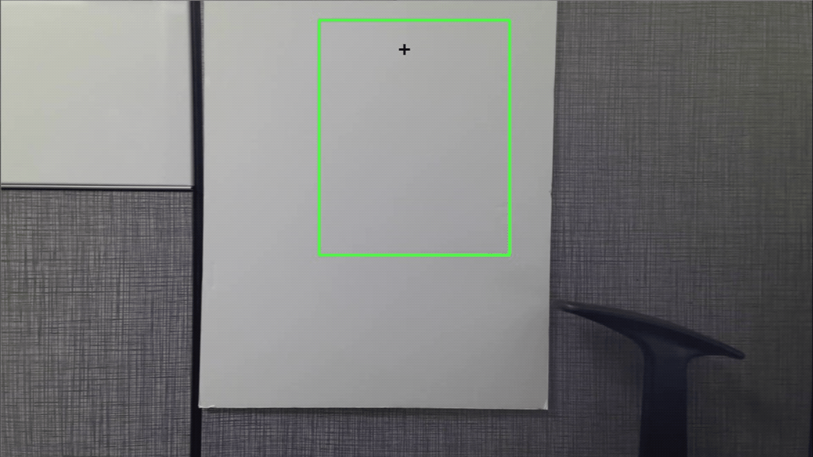

#### Python for Computer Vision with OpenCV and Deep Learning

#### Herb Guzman
#### UTSA
#### Fall 2019

Project Assignment: Create a program that can detect a hand, segment the had, and count the number of fingers being held up.
This file works with any web camera; to test this script file, an Azure Kinect V3 DK device was used.

###### Strategie for Counting Fingers

-  Grab a Range of Interest (ROI)
-  Calculate a running average background value for 60 frames of video (i.e. if rate is 30 frames/sec, then 2 seconds)
-  Once the average value has been found, the hand can enter the ROI
-  Once the hand is in the ROI, detect the change and apply thresholding to isolate the hand and hand segment
-  With the hand detected in the ROI, use a Convex Hull to draw a polygon around the hand
-  With the polygon outlined, calculate the center of the hand
-  Next, use the center of the hand to calculate the angle of the outer points to infer the finger count
   the polygon will have points at each finger.
-  Based on the distance from the center, determine if the finger is extended or not

#### How to Use

Need the following environment:

- Setup webcam or Azure Kinect DK camera
- Activate python environment
- Open Jupyter Notebook
- If using a laptop, the default camera is the built-in camera and is index '0'
- If using an external camera with a laptop that has a built-in camera,
  as with an Azure Kinect DK, use index '1'
- Example:
    cam = cv2.VideoCapture(1)
- Run all cells
- Two windows will come up: a binary (B&W) and an RGB real-time video screen
- Wait until the program determines the Region of Interest
- Insert hand in the region of interest and note the fingers detected
- Only insert the hand and not the arm

#### Demo of the Video Screen

#### References

(Portilla 2019)

Portilla, Jose Marcial. 2019, 'Python for Computer Vision with OpenCV and Deep Learning' Pierian Data, Udemy Online Course, October-December 2019, <https://www.udemy.com/topic/unity/> and <https://www.pieriandata.com/>.
